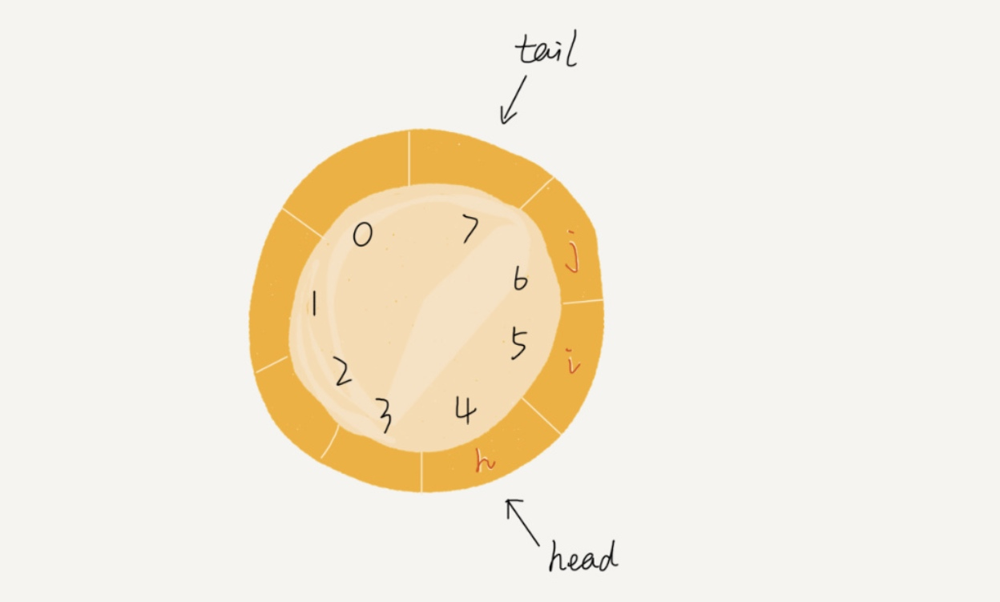

> 我去，你留 
> 两个秋                        
> 
——正冈子规

* TOC
{: toc}

### 队列的结构
----

队列是一种**先进先出**的数据结构，和栈类似，也是一种操作受限的线性表数据结构。

栈只有两个操作：入队（enqueue）和出队（dequeue）。从队尾插入元素，从头部取出元素。

### 实现
----

用数组实现的队列叫做顺序队列，用链表实现的叫做链式队列。

分别实现一下：

顺序队列：





链式队列：





还有一种十分重要的队列，**循环队列**。这个队列画出来吧，就是这样的：

这样的循环队列的实现要困难一些，不过更好确定队列空和队列满的情况。队列空就是`tail = head`，队列满就是tail在head的前一个位置，`(tail+1)%n = head`。

需要注意的是，tail指向的位置实际上并没有存数据。

代码实现：





### 阻塞队列和并发队列
----

其实，队列这种数据结构很基础，平时的业务开发不太可能需要从零实现一个队列，甚至都不会直接用到。但是一些特殊的队列应用很广，比如阻塞队列和并发队列。

**阻塞队列**其实就是在队列的基础上增加了阻塞操作，简单来说，就是在队列为空的时候，从队尾取数据会被阻塞，因为此时没有数据可以取，当有了数据之后才能返回；如果队列满了，那么插入数据操作就会被阻塞，当队列中有空闲位置之后再插入，然后再返回。这其实就是“生产者-消费者模型”。

线程安全的队列被称为**并发队列**。最简单的实现方式是直接在enqueue和dequeue方法上加锁，但是锁粒度大并发度会比较低，同一时刻仅允许一个存或者取操作。实际上，给予数组的循环队列，利用CSA院子操作，可以实现非常高效的并发队列。这也是循环队列比链式队列应用更加广泛的原因。

