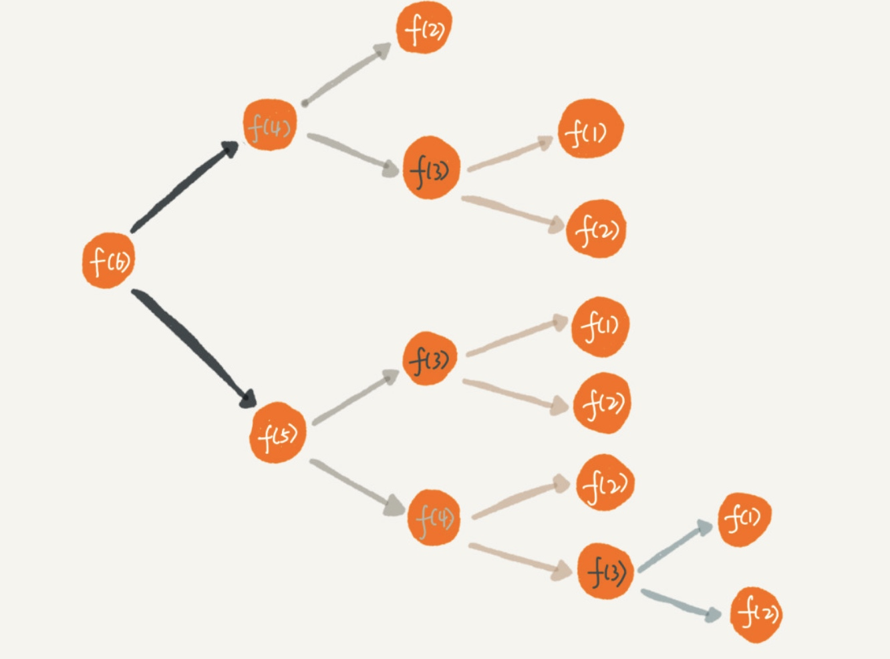

> 芦叶满汀洲，寒沙带浅流。二十年重到南楼。柳下系船犹未稳，能几日，又中秋。  
> 黄鹤断矶头，故人今在否。旧江山浑是新愁。欲买桂花重载酒，终不似，少年游。                          
> 
——刘过《唐多令》

* TOC
{:toc}

递归是一种应用非常广泛的算法（或者说是编程技巧）。之后的多算法，比如DFS、二叉树遍历等都需要用到，所以搞懂递归十分的重要。

## 一个例子
----

首先举一个例子🌰：

你去电影院看电影，你找了一个位置入座了，你想知道你现在是坐在第几排，于是你问你的前一个人，你在第几排，得到他的回复之后加一就是你所在的排。你前面的人为了知道自己在第几排，也问他前面的人，以此类推，直到第一排，第一排的人告诉后面我在第一排，第二个加一告诉后面的人我在第二排，然后到最后，你前面的人告诉他在第几排，你加一得到答案。

这个过程，就是一个典型的递归过程。我们可以写出一个递归公式：

$$f(n) = f(n-1) + 1$$

初始条件：$$f(1) = 1$$

## 三个条件
----

什么样的问题可以用递归来解决？下面有三个条件，只要能够同时满足就可以用递归的方法。

* 1.一个问题可以分解成几个子问题的解

子问题，对于这个上面这个例子来说，前面的人问他前面的人自己在第几排就是个子问题。

* 2.分解之后的子问题，求解思路一样

这个也很好理解。

* 3.有终止条件

$$f(1)=1$$，这个就是终止条件。

## 怎么写递归代码

总结起来就是：**找到递推公式，找到终止条件**

再举一个经典例子🌰：

加入一层楼有n个台阶，每次可以上1个台阶或者2个台阶，这n个台阶有多少种走法。

从最后一步来分析：

1.最后一步总共$$f(n)$$种走法，有公式$$f(n) = f(n-1) + f(n-2)$$。$$f(n-1)$$即走到n-1台阶的走法，$$f(n-2)$$即走到n-2台阶的走法。走一步或者走两步到n阶。

2.以此类推，$$f(n-1) = f(n-2) + f(n-3)$$等等

3.一直到最后停止，即$$f(1) = 1,f(2) = 2$$

这样可以写出代码：


int f(int n){
    if(n==1) return 1;
    if(n==2) return 2;
    return f(n-1)+f(n-2);
}


*递归真的好简洁，好漂亮*

总结一下：**写递归代码的关键就是将问题分解成小的子问题，找出递推公式，然后找到终止条件，最后翻译成代码。**

## 注意一些问题
----

### 堆栈溢出

使用递归的最大问题就是，堆栈的溢出。**函数调用会使用栈来保存临时变量**，每调用一个函数，都会将临时变量封装为栈压入内存栈，等函数执行完成返回的时候才出栈。系统栈或者虚拟机的空间都不会很大，如果递归求解的规模太大了，就会有堆栈溢出的风险。

那么，如何避免 =.=

最简单的就是设置递归的深度，如果递归到一定层次，就该结束抛出异常了

### 重复计算

就刚才那个上台阶的例子，如果画出图来是这样的：

可以看到，$$f(3)$$、$$f(4)$$等重复计算了很多。这样效率很低的，为了避免这个问题，我们可以设置一个散列表，计算了的值存进散列表，下次计算的时候如果已经算过了，直接取出来用就行了。

这样优化一下上面第二个的代码


Map map;
int f(int n){
    if(n==1) return 1;
    if(n==2) return 2;
    if(map.containsKey(n)) return map.get(n);
    int res = f(n-1) + f(n-2);
    map.put(n,res);
    return res; 
}



这样利用了空间换时间的思想。

## 递归改成非递归

递归有利有弊，利是代码的表达力强，非常简洁漂亮；弊是空间复杂度高，有堆栈溢出的风险、重复计算等。所以在实际的开发中，我们应该根据实际情况来选择是否需要递归来实现。所以接下来改写一下。

第一个例子🌰：


int f(int n){
    int res = 1;
    for(int i=2;i<=n;i++){
        res+=1;    
    }
    return res;
}


第二个例子🌰：


int f(int n){
    if(n == 1) return 1;
    if(n == 2) return 2;
    int pre = 2;
    int ppre = 1;
    int res = 0;
    for(int i=3;i<=n;i++){
        res = pre + ppre;
        ppre = pre;
        pre = res;
    }
    return res;
}


递归是其实用栈实现的，所以理论上，所有的递归代码都可以改成非递归代码。

## 思考

### 1.找到用户最终推荐人

现在有这样的一个场景：推荐注册返佣金。用户A推荐了B来注册，然后用户B推荐了用户C来注册，这样B和C的最终推荐人都是A，而且A没有最终的推荐人。

