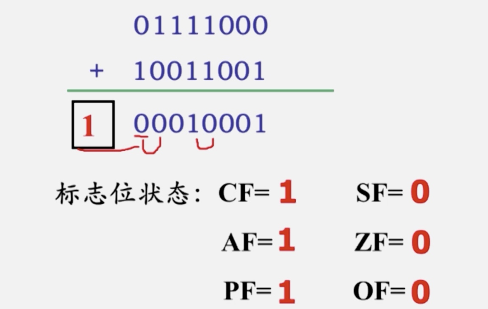

> 绝望的时候依然要临水照镜       
> 
——《私房书》



 

## 算数运算类指令

### 1.加法指令

* 普通加法指令 ADD
* 带进位的加法指令ADC 
* 加1指令INC 不会影响CF，之后影响后五位标志位 

#### ADD
例子：
MOV AL, 78H
ADD AL, 99H

> 标志位：
> 
> | CF | 进位标志 | SF | 符号标志 |
| AF | 辅助进位标志 | ZF | 结果为0标志 |
| PF | 奇偶标志 | OF | 溢出标志 |

#### ADC

OPRD1 + OPRD2 + CF -> OPRD1

多用于多字节数相加，使用之前一定要先把CF清零

#### INC

就是加一，但是操作数不能使段寄存器和立即数

INC指令的执行不影响CF，但会影响其余5位标志位

例子：
LEA SI, M1
LEA DI, M2
MOV CX, 20
CLC ;CF清零命令
NEXT: MOV AL, [SI]
ADX [DI],AL
INC DI
INC SI
DEC CX
JNC NEXT
HLT

如果是按字运算，
LEA SI, M1
LEA DI, M2
MOV CX, **10**
CLC
NEXT: MOV **AX**, [SI]
ADC [DI], **AX**
**ADD SI, 2**
**ADD DI, 2**
DEC CX
JNZ NEXT
HLT

### 2.减法指令

#### SUB 

> SUB OPRD1, OPRD2

和ADD类似，适用于两个字节数和两个多字节数，对多字节数就不适合了
#### SBB

> SBB OPRD1, OPRD2

OPRD1 - OPRD2 - CF -> OPRD1

SBB指令多用于两个多字节数的相减运算。

#### DEC

和INC类似

MOV BL, 2
NEXT1: MOV CX, 0FFFFH
NEXT2: DEC CX 
JNZ NEXT2 ;ZF=0 转NEXT2
DEC BL
JNZ NEXT1 ;ZF=0 转NEXT1
HLT

#### NEG

求补码 0-操作数

#### CMP
CMP OPRD1, OPRD2

OPRD1-OPRD2

指令执行的结果不影响目标操作数，仅影响标志位（CF），用作比较两个数的大小

CMP AX, BX（不带符号数）：

> 若AX-BX>=0 -> CF=0
> 
> 若AX-BX<0 - > CF=1
> 
> 若AX-BX=0 - > CF=1,ZF=1

带符号数：OF和SF共同决定

> OF和SF状态相同 AX>=BX
> 
> OF和SF状态不同 AX<BX


