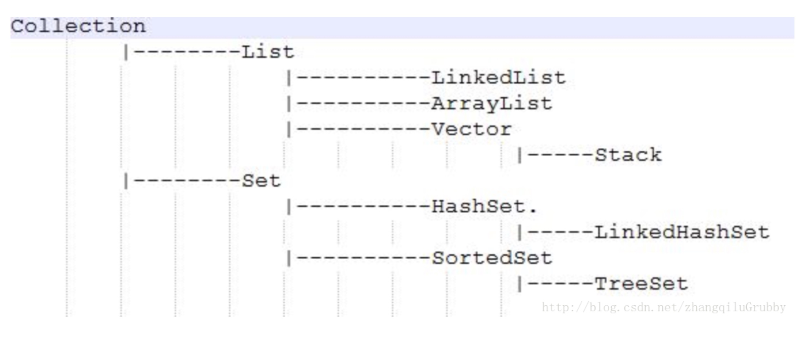

> 选择和努力一样重要。            

 

* TOC
{:toc}

## 一张继承图

## HashMap源码解析

### 概要

概括的说，HashMap 是一个关联数组、哈希表，它是线程不安全的，允许key为null(此时hash值为0),value为null。遍历时无序。 
其底层数据结构是数组称之为哈希桶，每个桶里面放的是链表，链表中的每个节点，就是哈希表中的每个元素。 
在JDK8中，当链表长度达到8，会转化成红黑树，以提升它的查询、插入效率，它实现了Map<K,V>, Cloneable, Serializable接口。

因其底层哈希桶的数据结构是数组，所以也会涉及到扩容的问题。

当HashMap的容量达到threshold域值时，就会触发扩容。扩容前后，哈希桶的长度一定会是2的次方。 
这样在根据key的hash值寻找对应的哈希桶时，可以用位运算替代取余操作，更加高效。

而key的hash值，并不仅仅只是key对象的hashCode()方法的返回值，还会经过扰动函数的扰动，以使hash值更加均衡。 
因为hashCode()是int类型，取值范围是40多亿，只要哈希函数映射的比较均匀松散，碰撞几率是很小的。 
但就算原本的hashCode()取得很好，每个key的hashCode()不同，但是由于HashMap的哈希桶的长度远比hash取值范围小，默认是16，所以当对hash值以桶的长度取余，以找到存放该key的桶的下标时，由于取余是通过与操作完成的，会忽略hash值的高位。因此只有hashCode()的低位参加运算，发生不同的hash值，但是得到的index相同的情况的几率会大大增加，这种情况称之为hash碰撞。 即，碰撞率会增大。

扰动函数就是为了解决hash碰撞的。它会综合hash值高位和低位的特征，并存放在低位，因此在与运算时，相当于高低位一起参与了运算，以减少hash碰撞的概率。（在JDK8之前，扰动函数会扰动四次，JDK8简化了这个操作）

扩容操作时，会new一个新的Node数组作为哈希桶，然后将原哈希表中的所有数据(Node节点)移动到新的哈希桶中，相当于对原哈希表中所有的数据重新做了一个put操作。所以性能消耗很大，可想而知，在哈希表的容量越大时，性能消耗越明显。

扩容时，如果发生过哈希碰撞，节点数小于8个。则要根据链表上每个节点的哈希值，依次放入新哈希桶对应下标位置。 
因为扩容是容量翻倍，所以原链表上的每个节点，现在可能存放在原来的下标，即low位， 或者扩容后的下标，即high位。 high位= low位+原哈希桶容量 
如果追加节点后，链表数量》=8，则转化为红黑树

由迭代器的实现可以看出，遍历HashMap时，顺序是按照哈希桶从低到高，链表从前往后，依次遍历的。属于无序集合。

### 继承关系

HashMap继承自AbstractMap，实现了Map/Cloneable/Serialzable。

### 节点的源码


static class Node<K,V> implements Map.Entry<K,V> {
        final int hash;
        final K key;
        V value;
        Node<K,V> next;

        Node(int hash, K key, V value, Node<K,V> next) {
            this.hash = hash;
            this.key = key;
            this.value = value;
            this.next = next;
        }

        public final K getKey()        { return key; }
        public final V getValue()      { return value; }
        public final String toString() { return key + "=" + value; }

        public final int hashCode() {
            return Objects.hashCode(key) ^ Objects.hashCode(value);
        }

        public final V setValue(V newValue) {
            V oldValue = value;
            value = newValue;
            return oldValue;
        }

        public final boolean equals(Object o) {
            if (o == this)
                return true;
            if (o instanceof Map.Entry) {
                Map.Entry<?,?> e = (Map.Entry<?,?>)o;
                if (Objects.equals(key, e.getKey()) &&
                    Objects.equals(value, e.getValue()))
                    return true;
            }
            return false;
        }
    }



* Node的hashCode，是通过key和value的hashCode值异或得到的
* HashMap里面的hash是key的hashCode方法异或右移16位

### resize()源码



final Node<K,V>[] resize() {
        //oldTab 为当前表的哈希桶
        Node<K,V>[] oldTab = table;
        //当前哈希桶的容量 length
        int oldCap = (oldTab == null) ? 0 : oldTab.length;
        //当前的阈值
        int oldThr = threshold;
        //初始化新的容量和阈值为0
        int newCap, newThr = 0;
        //如果当前容量大于0
        if (oldCap > 0) {
            //如果当前容量已经到达上限
            if (oldCap >= MAXIMUM_CAPACITY) {
                //则设置阈值是2的31次方-1
                threshold = Integer.MAX_VALUE;
                //同时返回当前的哈希桶，不再扩容
                return oldTab;
            }//否则新的容量为旧的容量的两倍。 
            else if ((newCap = oldCap << 1) < MAXIMUM_CAPACITY &&
                     oldCap >= DEFAULT_INITIAL_CAPACITY)//如果旧的容量大于等于默认初始容量16
                //那么新的阈值也等于旧的阈值的两倍
                newThr = oldThr << 1; // double threshold
        }//如果当前表是空的，但是有阈值。代表是初始化时指定了容量、阈值的情况
        else if (oldThr > 0) // initial capacity was placed in threshold
            newCap = oldThr;//那么新表的容量就等于旧的阈值
        else {}//如果当前表是空的，而且也没有阈值。代表是初始化时没有任何容量/阈值参数的情况               // zero initial threshold signifies using defaults
            newCap = DEFAULT_INITIAL_CAPACITY;//此时新表的容量为默认的容量 16
            newThr = (int)(DEFAULT_LOAD_FACTOR * DEFAULT_INITIAL_CAPACITY);//新的阈值为默认容量16 * 默认加载因子0.75f = 12
        }
        if (newThr == 0) {//如果新的阈值是0，对应的是  当前表是空的，但是有阈值的情况
            float ft = (float)newCap * loadFactor;//根据新表容量 和 加载因子 求出新的阈值
            //进行越界修复
            newThr = (newCap < MAXIMUM_CAPACITY && ft < (float)MAXIMUM_CAPACITY ?
                      (int)ft : Integer.MAX_VALUE);
        }
        //更新阈值 
        threshold = newThr;
        @SuppressWarnings({"rawtypes","unchecked"})
        //根据新的容量 构建新的哈希桶
            Node<K,V>[] newTab = (Node<K,V>[])new Node[newCap];
        //更新哈希桶引用
        table = newTab;
        //如果以前的哈希桶中有元素
        //下面开始将当前哈希桶中的所有节点转移到新的哈希桶中
        if (oldTab != null) {
            //遍历老的哈希桶
            for (int j = 0; j < oldCap; ++j) {
                //取出当前的节点 e
                Node<K,V> e;
                //如果当前桶中有元素,则将链表赋值给e
                if ((e = oldTab[j]) != null) {
                    //将原哈希桶置空以便GC
                    oldTab[j] = null;
                    //如果当前链表中就一个元素，（没有发生哈希碰撞）
                    if (e.next == null)
                        //直接将这个元素放置在新的哈希桶里。
                        //注意这里取下标 是用 哈希值 与 桶的长度-1 。 由于桶的长度是2的n次方，这么做其实是等于 一个模运算。但是效率更高
                        newTab[e.hash & (newCap - 1)] = e;
                        //如果发生过哈希碰撞 ,而且是节点数超过8个，转化成了红黑树（暂且不谈 避免过于复杂， 后续专门研究一下红黑树）
                    else if (e instanceof TreeNode)
                        ((TreeNode<K,V>)e).split(this, newTab, j, oldCap);
                    //如果发生过哈希碰撞，节点数小于8个。则要根据链表上每个节点的哈希值，依次放入新哈希桶对应下标位置。
                    else { // preserve order
                        //因为扩容是容量翻倍，所以原链表上的每个节点，现在可能存放在原来的下标，即low位， 或者扩容后的下标，即high位。 high位=  low位+原哈希桶容量
                        //低位链表的头结点、尾节点
                        Node<K,V> loHead = null, loTail = null;
                        //高位链表的头节点、尾节点
                        Node<K,V> hiHead = null, hiTail = null;
                        Node<K,V> next;//临时节点 存放e的下一个节点
                        do {
                            next = e.next;
                            //这里又是一个利用位运算 代替常规运算的高效点： 利用哈希值 与 旧的容量，可以得到哈希值去模后，是大于等于oldCap还是小于oldCap，等于0代表小于oldCap，应该存放在低位，否则存放在高位
                            if ((e.hash & oldCap) == 0) {
                                //给头尾节点指针赋值
                                if (loTail == null)
                                    loHead = e;
                                else
                                    loTail.next = e;
                                loTail = e;
                            }//高位也是相同的逻辑
                            else {
                                if (hiTail == null)
                                    hiHead = e;
                                else
                                    hiTail.next = e;
                                hiTail = e;
                            }//循环直到链表结束
                        } while ((e = next) != null);
                        //将低位链表存放在原index处，
                        if (loTail != null) {
                            loTail.next = null;
                            newTab[j] = loHead;
                        }
                        //将高位链表存放在新index处
                        if (hiTail != null) {
                            hiTail.next = null;
                            newTab[j + oldCap] = hiHead;
                        }
                    }
                }
            }
        }
        return newTab;
    }



需要注意的：

* 默认容量16，2的幂次方
* 利用hashCode & 哈希桶的长度-1 完成模运算，效率更高
* 如果哈希碰撞，超过8个节点就转化成红黑树
* 利用哈希值 与 旧的容量，得到哈希值去模，后是大于等于oldCap还是小于oldCap，等于0代表小于oldCap，应该存放在低位，否则存放在高位

### putVal 插入节点



final V putVal(int hash, K key, V value, boolean onlyIfAbsent,
                   boolean evict) {
        //tab存放 当前的哈希桶， p用作临时链表节点  
        Node<K,V>[] tab; Node<K,V> p; int n, i;
        //如果当前哈希表是空的，代表是初始化
        if ((tab = table) == null || (n = tab.length) == 0)
            //那么直接去扩容哈希表，并且将扩容后的哈希桶长度赋值给n
            n = (tab = resize()).length;
        //如果当前index的节点是空的，表示没有发生哈希碰撞。 直接构建一个新节点Node，挂载在index处即可。
        //这里再啰嗦一下，index 是利用 哈希值 & 哈希桶的长度-1，替代模运算
        if ((p = tab[i = (n - 1) & hash]) == null)
            tab[i] = newNode(hash, key, value, null);
        else {//否则 发生了哈希冲突。
            //e
            Node<K,V> e; K k;
            //如果哈希值相等，key也相等，则是覆盖value操作
            if (p.hash == hash &&
                ((k = p.key) == key || (key != null && key.equals(k))))
                e = p;//将当前节点引用赋值给e
            else if (p instanceof TreeNode)//红黑树暂且不谈
                e = ((TreeNode<K,V>)p).putTreeVal(this, tab, hash, key, value);
            else {//不是覆盖操作，则插入一个普通链表节点
                //遍历链表
                for (int binCount = 0; ; ++binCount) {
                    if ((e = p.next) == null) {//遍历到尾部，追加新节点到尾部
                        p.next = newNode(hash, key, value, null);
                        //如果追加节点后，链表数量》=8，则转化为红黑树
                        if (binCount >= TREEIFY_THRESHOLD - 1) // -1 for 1st
                            treeifyBin(tab, hash);
                        break;
                    }
                    //如果找到了要覆盖的节点
                    if (e.hash == hash &&
                        ((k = e.key) == key || (key != null && key.equals(k))))
                        break;
                    p = e;
                }
            }
            //如果e不是null，说明有需要覆盖的节点，
            if (e != null) { // existing mapping for key
                //则覆盖节点值，并返回原oldValue
                V oldValue = e.value;
                if (!onlyIfAbsent || oldValue == null)
                    e.value = value;
                //这是一个空实现的函数，用作LinkedHashMap重写使用。
                afterNodeAccess(e);
                return oldValue;
            }
        }
        //如果执行到了这里，说明插入了一个新的节点，所以会修改modCount，以及返回null。

        //修改modCount
        ++modCount;
        //更新size，并判断是否需要扩容。
        if (++size > threshold)
            resize();
        //这是一个空实现的函数，用作LinkedHashMap重写使用。
        afterNodeInsertion(evict);
        return null;
    }



## ConcurrentHashMap

线程安全的HashMap，HashTable的同步操作太重了，这个轻一些。之前采用的Segment分段锁，JDK8中，采用了CAS算法。底层仍然是数组+链表+红黑树。为了并发，加了很多内部类，比如TreeBin，Traverser等对象内部类。

### sizeCtl

单独把这个拿出来，是一个控制标识符

* 负数代表正在进行初始化或扩容操作
* -1代表正在初始化
* -N 表示有N-1个线程正在进行扩容操作
* 0代表hash表还没有被初始化
* 整数表示初始化或下一次进行扩容的大小，这一点类似于扩容阈值的概念。还后面可以看到，它的值始终是当前ConcurrentHashMap容量的0.75倍，这与loadfactor是对应的。

### 继承关系

继承AbstractMap，实现ConcurrentMap/ConcurrentMap

### 节点源码



static final class HashEntry<K,V> {
        final int hash;
        final K key;
        volatile V value;
        volatile HashEntry<K,V> next;
}



* 这里的HashEntry的value值是volatile修饰的，所以可以直接读取。
* 还有TreeNode，在链表过长的时候，交给TreeBin，由TreeBin完成对红黑树的包装。

### 三个原子操作



@SuppressWarnings("unchecked")
    //获得在i位置上的Node节点
    static final <K,V> Node<K,V> tabAt(Node<K,V>[] tab, int i) {
        return (Node<K,V>)U.getObjectVolatile(tab, ((long)i << ASHIFT) + ABASE);
    }
		//利用CAS算法设置i位置上的Node节点。之所以能实现并发是因为他指定了原来这个节点的值是多少
		//在CAS算法中，会比较内存中的值与你指定的这个值是否相等，如果相等才接受你的修改，否则拒绝你的修改
		//因此当前线程中的值并不是最新的值，这种修改可能会覆盖掉其他线程的修改结果  有点类似于SVN
    static final <K,V> boolean casTabAt(Node<K,V>[] tab, int i,
                                        Node<K,V> c, Node<K,V> v) {
        return U.compareAndSwapObject(tab, ((long)i << ASHIFT) + ABASE, c, v);
    }
		//利用volatile方法设置节点位置的值
    static final <K,V> void setTabAt(Node<K,V>[] tab, int i, Node<K,V> v) {
        U.putObjectVolatile(tab, ((long)i << ASHIFT) + ABASE, v);
    }
    


### ConCurrentHashMap初始化



/**
     * Initializes table, using the size recorded in sizeCtl.
     */
    private final Node<K,V>[] initTable() {
        Node<K,V>[] tab; int sc;
        while ((tab = table) == null || tab.length == 0) {
        		//sizeCtl表示有其他线程正在进行初始化操作，把线程挂起。对于table的初始化工作，只能有一个线程在进行。
            if ((sc = sizeCtl) < 0)
                Thread.yield(); // lost initialization race; just spin
            else if (U.compareAndSwapInt(this, SIZECTL, sc, -1)) {//利用CAS方法把sizectl的值置为-1 表示本线程正在进行初始化
                try {
                    if ((tab = table) == null || tab.length == 0) {
                        int n = (sc > 0) ? sc : DEFAULT_CAPACITY;
                        @SuppressWarnings("unchecked")
                        Node<K,V>[] nt = (Node<K,V>[])new Node<?,?>[n];
                        table = tab = nt;
                        sc = n - (n >>> 2);//相当于0.75*n 设置一个扩容的阈值
                    }
                } finally {
                    sizeCtl = sc;
                }
                break;
            }
        }
        return tab;
    }



* 构造方法仅仅是设置了一些参数，整个table的初始化实在插入元素的时候发生的。

//TODO 等待完善

https://blog.csdn.net/u010723709/article/details/48007881

## HashTable

### 继承关系

继承Dictionary，实现 Map/Cloneable/Serializable

## LinedList

### 概述

概括的说，LinkedList 是线程不安全的，允许元素为null的双向链表。 
其底层数据结构是链表，它实现List<E>, Deque<E>, Cloneable, java.io.Serializable接口，它实现了Deque<E>,所以它也可以作为一个双端队列。和ArrayList比，没有实现RandomAccess所以其以下标，随机访问元素速度较慢。

因其底层数据结构是链表，所以可想而知，它的增删只需要移动指针即可，故时间效率较高。不需要批量扩容，也不需要预留空间，所以空间效率比ArrayList高。

缺点就是需要随机访问元素时，时间效率很低，虽然底层在根据下标查询Node的时候，会根据index判断目标Node在前半段还是后半段，然后决定是顺序还是逆序查询，以提升时间效率。不过随着n的增大，总体时间效率依然很低。

当每次增、删时，都会修改modCount。

### 继承关系

继承AbstractList，实现ist/RandomAccess/Cloneable/Serializable

### CRUD

* 链表批量增加，是靠for循环遍历原数组，依次执行插入节点操作。对比ArrayList是通过System.arraycopy完成批量增加的。增加一定会修改modCount。通过下标获取某个node 的时候，（add select），会根据index处于前半段还是后半段 进行一个折半，以提升查询效率

* 删也一定会修改modCount。 按下标删，也是先根据index找到Node，然后去链表上unlink掉这个Node。 按元素删，会先去遍历链表寻找是否有该Node，如果有，去链表上unlink掉这个Node。

* 改也是先根据index找到Node，然后替换值。改不修改modCount。
* 查本身就是根据index找到Node。

所以它的CRUD操作里，都涉及到根据index去找到Node的操作。

## ArrayList

概括的说，ArrayList 是一个动态数组，它是线程不安全的，允许元素为null。 
其底层数据结构依然是数组，它实现了List<E>, RandomAccess, Cloneable, java.io.Serializable接口，其中RandomAccess代表了其拥有随机快速访问的能力，ArrayList可以以O(1)的时间复杂度去根据下标访问元素。

因其底层数据结构是数组，所以可想而知，它是占据一块连续的内存空间（容量就是数组的length），所以它也有数组的缺点，空间效率不高。

由于数组的内存连续，可以根据下标以O1的时间读写(改查)元素，因此时间效率很高。

当集合中的元素超出这个容量，便会进行扩容操作。扩容操作也是ArrayList 的一个性能消耗比较大的地方，所以若我们可以提前预知数据的规模，应该通过public ArrayList(int initialCapacity) {}构造方法，指定集合的大小，去构建ArrayList实例，以减少扩容次数，提高效率。

或者在需要扩容的时候，手动调用public void ensureCapacity(int minCapacity) {}方法扩容。 
不过该方法是ArrayList的API，不是List接口里的，所以使用时需要强转: 
((ArrayList)list).ensureCapacity(30);

## Vector

